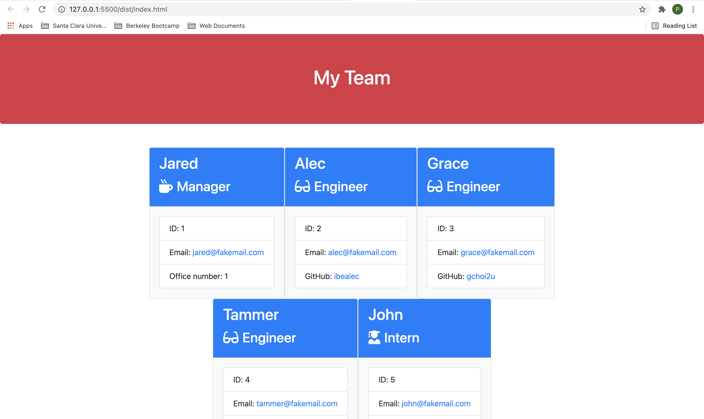

# Team Portfolio Generator

## License 

[](https://opensource.org/licenses/MIT)

## Short Description

This node.js project allows companies to manage and organize their employment directory based on job-titles - such as Engineers, Managers, and Interns. Companies that use this program can update, add and review their list of employees, along with their background and contact information, once adding thee manager's details. 

## Before You Begin - Installation Proceess

Before starting up this program, its esseential to have a few files installed on your local computer.

First, clone this repository using your terminal/command-line interface. 

```
git clone git@github.com:pbyakod/team_portfolios.git
```

Next, install the inquirer node packages using the efollowing commands.

```
npm init -y
npm i inquirer
```

Once complete, run the application with thee following line.

```
node index.js
```

## Webpage Preview

</img>

## Walkthrough Video Link

<a href="https://drive.google.com/file/d/1LOgZyjJZNXZ74rfG5DlvpglCIRYj4Jz1/view?usp=sharing">Link to video</a>